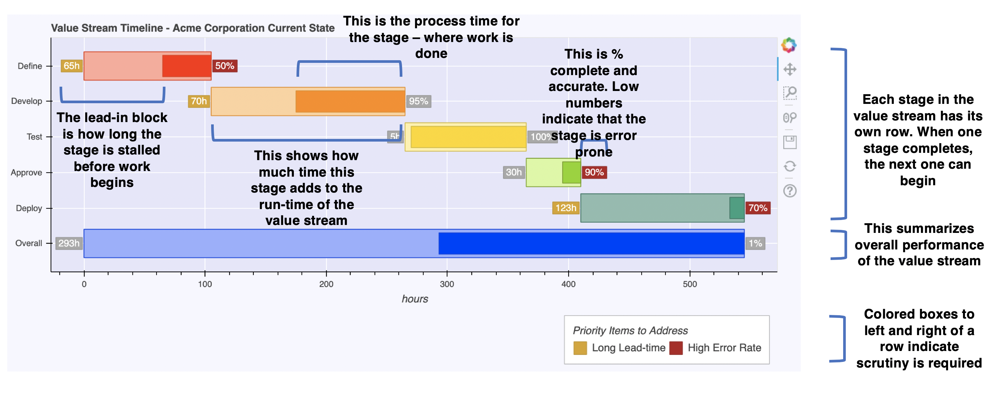

Timemap will gernerate a Gantt-like chart describing the output of a value stream mapping exercise.

The map itself is stored in a four column CSV file, with fields for:

* stage (or task) name,
* lead-time (how long the stage takes),
* process time (how much time is actuially spent working on getting the stage completed, and
* percent complete and accurate (How often the stage is completed correctly and doesn't need to be sent back)

An annotated version of the output looks like this:



It can be incredibly useful to visualize how a process looks upon completing the initila value stream mapping exercise, and then again once process improvements have been determined. You can use the `--xrange` flag to keep the scales the same for both before and after charts.

Getting Started
----------------------

```
$ pip3 install -r requirements.txt
$ python3 timemap.py examples/example.csv
```

Command Line Arguments
----------------------

```
$ python3 timemap.py --help
Usage: timemap.py [OPTIONS] FILE

  Generate a HTML chart presenting timeline from a Value Stream Mapping
  exercise

Options:
  -h, --height INTEGER  Figure height
  -i, --items INTEGER   Number of worst items to highlight
  -t, --title TEXT      Figure title
  -u, --units [h|d|w]   Display units (h (hours), d (days), w (weeks))
  -w, --width INTEGER   Figure width
  -x, --xrange INTEGER  Figure Max X value
  --help                Show this message and exit.
$ 
```
